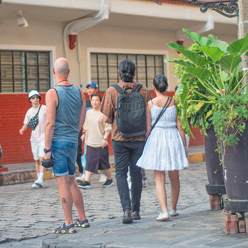
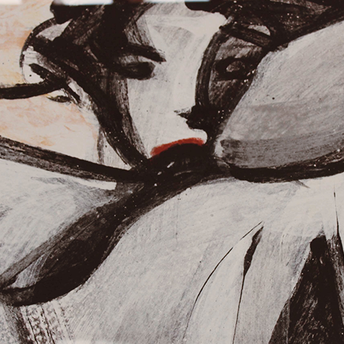
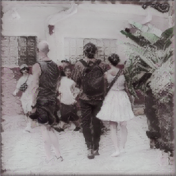
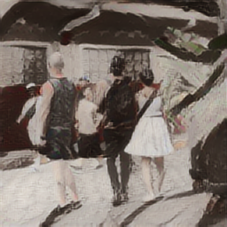

# Image Style Transfer Web Application

## GitHub Repository
https://github.com/GenuinoVitto/DIGIMAP-style-transfer

## Authors
### DIGIMAP S11 - Group 3
- FONG, Hannah Regine C.
- GENUINO, Jose Mari Victorio G.
- GOMEZ, Alessandra Pauleen I.
- TIGHE, Kaitlyn Patricia

## Application Features
### Overview
With the rise of new AIs and other software that take image processing to another level, one of the most common maniuplations done on an image is taking the art style of another image and trying to apply it to the source image, so that it looks as if the image is painted or is an artwork by the artist who uses that particular style.

This computer vision technique is called image style transfer. It makes use of convolutional neural networks to recompose an image into integrating the texture of the style image.

This project centers on creating a web application that can implement image style transfer. With the aid of libraries such as TensorFlow.js and Magenta.js, applying the algorithm becomes easier. The project makes use of the algorithm illustrated by Gatys et. al in their paper, A Neural Algorithm of Artistic Style (see References).

### How to Run the Application
1. In the command line, navigate to the directory of the project and run `npm install`. This will only be done once in order to install the necessary packages used in the project.
2. Run the command `npm start`. A `localhost:3000` page will be loaded automatically, containing the application.

### How to Use the Application
1. Upload the image you want to style under ***Content Image***.
2. Under ***Style Image***, you can opt to upload a custom photo with the art style you want to apply to the content image. You may also choose among four preset style images, featuring pieces from Filipino artists Arturo Luz, Benedicto Cabrera, Fernando Amorsolo, and Juvenal Sanso.
3. Choose between the ***Fast Style*** or ***GPU Style*** options to determine which style transfer algorithm will be executed and wait for the stylized image to appear.
4. You may opt to download the stylized image using the download button.

### Sample Inputs and Outputs
**Sample Content Image** 

**Sample Custom Style Image** 

**Generated Fast Stylized Image** 

**Generated GPU Stylized Image** 

## Technology Stack
| Aspect                | Tool                          |
| --------------------- | ----------------------------- |
| Front-End Framework   | React.js                      |
| Back-End APIs         | Magenta.js and TensorFlow.js  |
| Version Control       | GitHub                        |
| Deployment            | Vercel                        |

## References
### Published Research Paper
- Gatys, L. A., Ecker, A. S., & Bethge, M. (2016, September). A Neural Algorithm of Artistic Style. *Journal of Vision*, *16*(12), 326. https://doi.org/10.1167/16.12.326

### Source Code Implementation
- de Guzman, C. E, Roncal, R., & Rebong, L. H. (2022, August 21). Style Transfer Web App Using TensorFlow.js and React.js [GitHub Repository]. https://github.com/cyril-deguzman/react-style-transfer